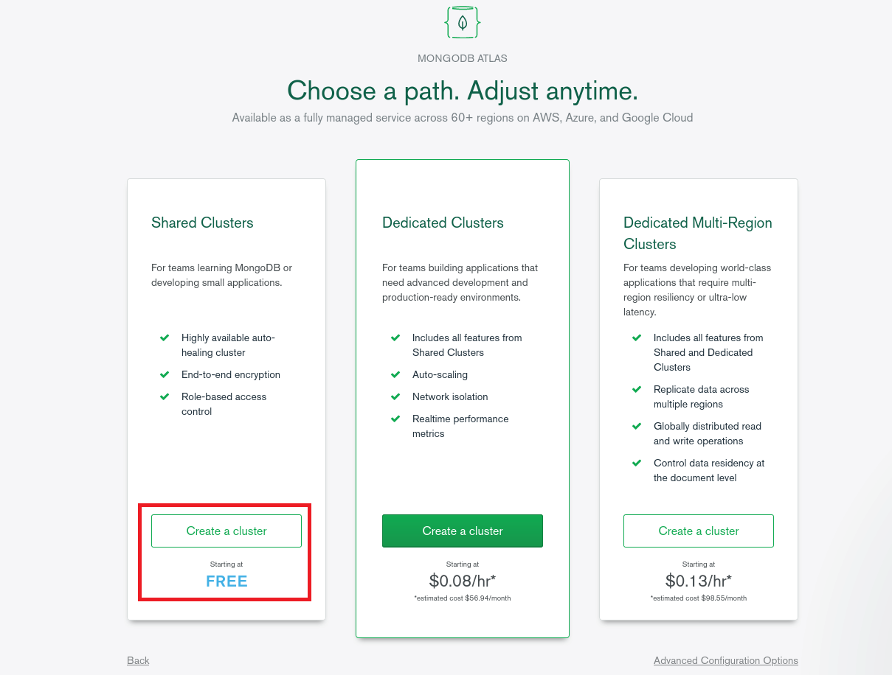
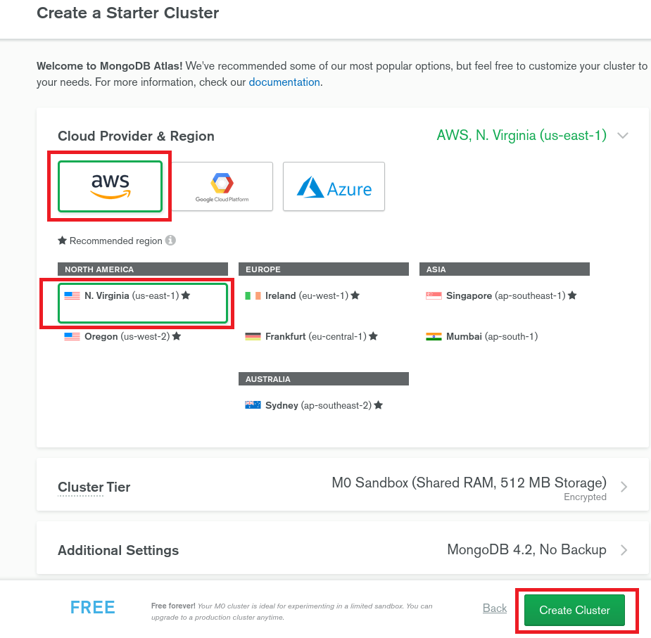
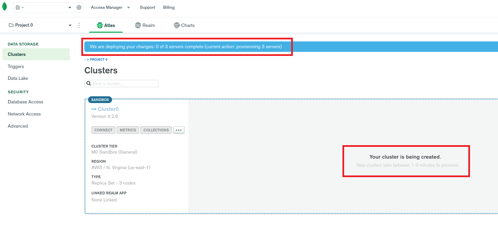
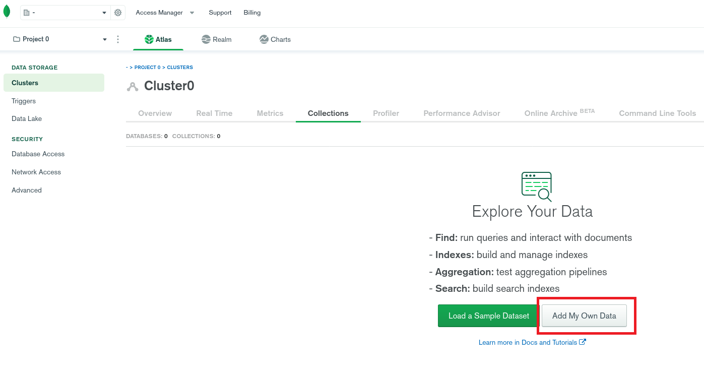
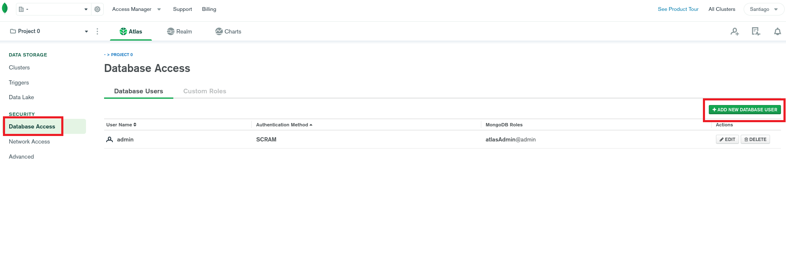
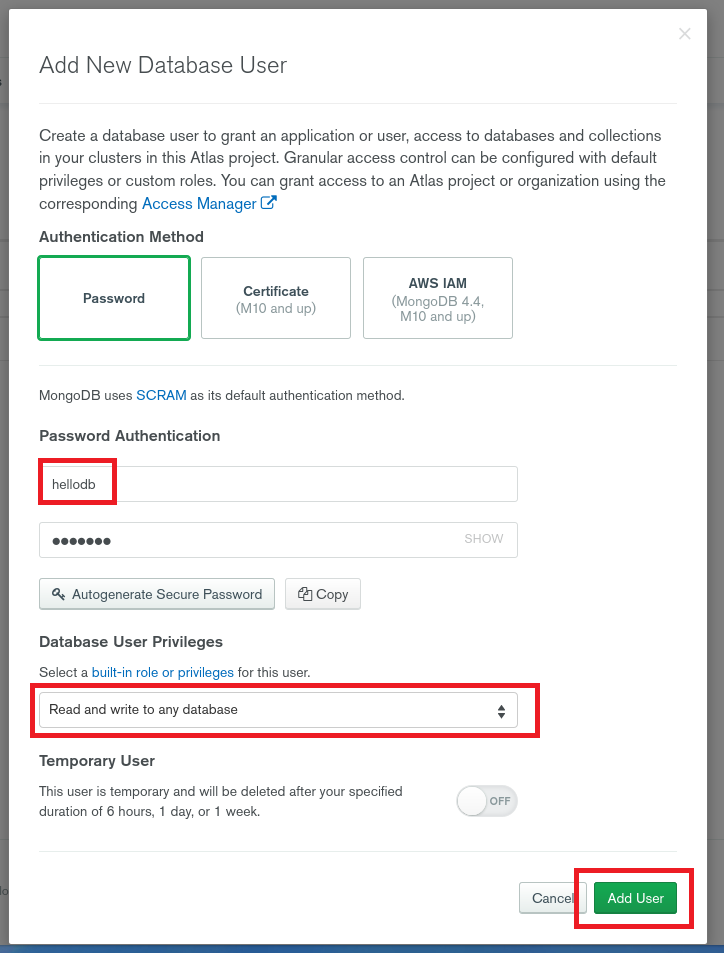
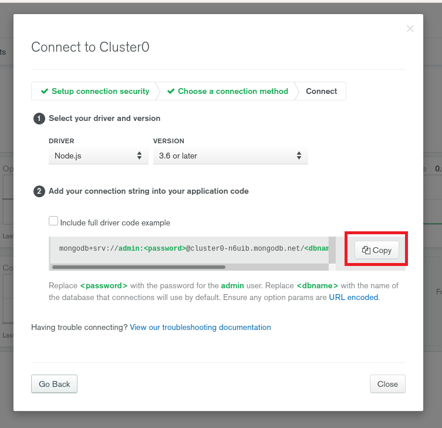
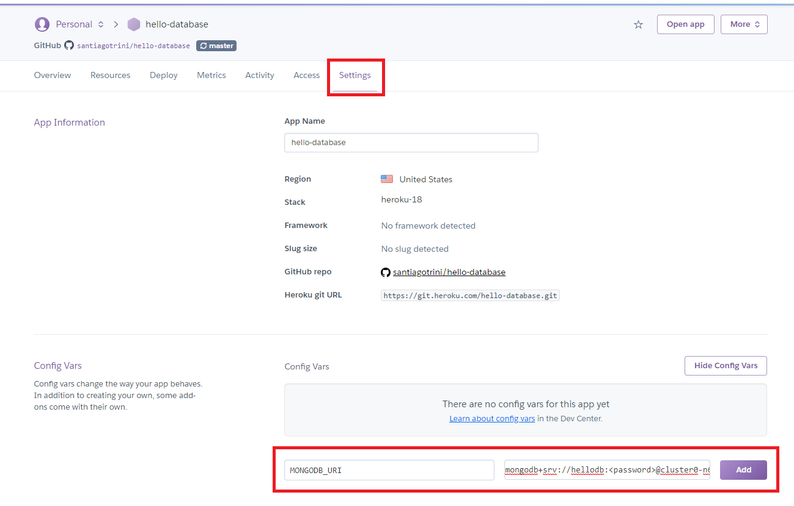

# Hello Database

API en Express + MongoDB

## Qué vamos a hacer

Una API (_application programming interface_) para comunicarnos con una base de datos de MongoDB. No voy a explicar que es una base de datos, ya tienen una materia entera para eso.

Este es uno de los usos más comunes de Express. Una API nos da una interfaz para comunicar una aplicación web (_frontend_) con una base de datos. Tanto la base de datos como la aplicación de Express se consideran parte del _backend_.

El ejemplo va a ser mínimo, tenemos una base de datos con usuarios y a través de la API podemos obtener esa información en formato JSON. Ya tendremos tiempo de complicar más las cosas.

## Antes de empezar

Para este ejemplo necesitamos lo mismo que en `express-hello-world` y dos cosas más:

- Una cuenta en MongoDB Atlas
- El server de MongoDB instalado en nuestra computadora (para probar localmente).

Cuando instalen el server de MongoDB en Windows pueden omitir la instalación de MongoDB Compass, hay un checkbox en el instalador. No lo vamos a usar.

Verificar que podamos acceder a la _shell_ de MongoDB en la terminal. Si esto no funciona es porque no tienen el ejecutable en el PATH. Tarea de investigación como editar variables de entorno en Windows. Concretamente agregar la ruta `C:\Program Files\MongoDB\Server\4.2\bin` (o algo similar) a la variable de entorno PATH.

```
$ mongo --version
MongoDB shell version v4.2.7
... etc ...
$ mongo
> exit
bye
```

Si al ejecutar mongo nos recibe un prompt de Mongo (el `>`) va todo bien. Pueden salir con exit.

## Creando el proyecto

Esto ya lo vimos, en resumen:

```
$ mkdir hello-database
$ cd hello-database
$ git init
$ npm init -y
$ echo node_modules > .gitignore
$ npm install express
$ touch index.js
```

Recuerden que `npm install` requiere Internet. Agregamos una nueva librería para conectarnos y trabajar con bases de datos de MongoDB.

```
$ npm install mongoose
```

Agregamos a `scripts` en el `package.json` la propiedad `"start": "node index.js"` (lo mismo que hicimos en `express-hello-world`).

## Mandamos JavaScript

En `index.js` le decimos a nuestra app que se conecte a la base de datos.

```js
// index.js

// ahora tambien importamos mongoose
const express  = require('express');
const mongoose = require('mongoose');

// puerto y base de datos
const port = process.env.PORT        || 3000;
const db   = process.env.MONGODB_URI || 'mongodb://localhost/hellodb';

const app = express();

// conexion a la base de datos
mongoose.set('useUnifiedTopology', true);
mongoose.set('useFindAndModify', false);
mongoose
  .connect(db, { useNewUrlParser: true })
  .then(() => {
    console.log(`DB connected @ ${db}`);
  })
.catch(err => console.error(`Connection error ${err}`));

// el server escucha todo
app.listen(port, () => {
  console.log(`Server listening on port ${port}`);
});
```

Aparecieron algunas cosas nuevas. En primer lugar importamos una libreria nueva: mongoose. En segundo lugar ademas de la variable que indica el puerto del server tenemos una similar para la base de datos, misma idea, un valor cuando estamos en Heroku y otro cuando ejecutamos localmente. La URI `mongodb://localhost/hellodb` es la base de datos local en nuestra computadora.

Todo lo que está entre el primer `mongoose.set` y el `.catch()` es el _snippet_ de código para conectarnos a una base de datos con mongoose. Un _snippet_ es un pedazo de código que copiamos prácticamente igual en distintas aplicaciones. En resumen son dos llamados a la función `mongoose.set()` para evitar unos _warnings_ (prueben de comentar esas dos líneas). Y un llamado a la función `mongoose.connect()`. El motivo de que lo vean raro es que usa algo llamado **promesas**, que en esencia cumple la misma función que una _callback_.

En `app.listen()` sí usamos una _callback_. Es el segundo argumento de la función. Los dos usos de `console.log()` son para mostrar que todo anduvo bien y que nuestro server esta escuchando en tal puerto y conectado a tal base de datos. Pueden probar la app con `npm start` y van a ver algo similar a esto.

```
$ npm start

> hello-database@1.0.0 start /home/santiago/hello-database
> node index.js

Server listening on port 3000
DB connected @ mongodb://localhost/hellodb
```

## Creando la base de datos

Tenemos que crear una base de datos para trabajar. Lo hacemos mediante un sencillo script usando Mongoose. Las bases de datos de MongoDB guardan la información en colecciones de documentos. Las colecciones pueden ser usuarios, animales, compras o lo que ustedes quieran. Los documentos son objetos de JavaScript. En nuestro caso vamos a tener una colección de usuarios, y el objeto que represente un usuario va a tener esta pinta.

```js
{
  id: 1,
  name: 'Juan',
  mail: 'juan@mail.com',
  birthday: '2000-01-14'
}
```

Cada usuario va a ser un documento en la colección de usuarios. Una colección no es más que un array de objetos con idéntica estructura. Por si todavía no se enteraron la idea acá es que (casi) todo se hace en JavaScript, bases de datos incluídas.

Para que Mongoose interactúe con MongoDB tenemos que crear **modelos**. Un modelo es un objeto que describe una colección, y lo hacemos generalmente en un archivo separado dentro de una carpeta llamada `models`. Así que en la terminal.

```
$ mkdir models
$ cd models
$ touch User.js
```

La convención es usar SnakeCase y nombres en singular para los nombres de los archivos de los modelos. Si tenemos un modelo de animales será `Animal.js`. Si tenemos animales de zoológico será `ZooAnimal.js`. El archivo `models/User.js` quedaría así.

```js
// User.js

// necesitamos importar mongoose
const mongoose = require('mongoose');

// los modelos se crean a partir de un schema
const UserSchema = new mongoose.Schema({
  id: Number,
  name: String,
  mail: String,
  birthday: Date
});
// el schema describe la pinta de un documento de la coleccion

// creamos el modelo llamando a mongoose.model(nombre, schema)
const User = mongoose.model('User', UserSchema);

// hay que exportar el modelo para usarlo despues en otros archivos
module.exports = User;
```

El ejemplo de `User.js` es bien sencillo pero los _schemas_ tienen muchas características más que iremos viendo a medida que las necesitemos. La documentación oficial de Mongoose es la referencia para este tipo de cosas: https://mongoosejs.com/docs/guide.html.

Con el modelo listo nos creamos un script llamado `populatedb.js` en la carpeta del proyecto y copiamos el siguiente código.

```js
// populatedb.js

// necesitamos importar mongoose
const mongoose = require('mongoose');

// importar el modelo de usuario
const User = require('./models/User');

// la URI de la db
const db = 'mongodb://localhost/hellodb';

// array de usuarios para ingresar a la db
const users = [
  {
    id: 1,
    name: 'Juan',
    mail: 'juan@mail.com',
    birthday: '2000-05-24'
  },
  {
    id: 2,
    name: 'Maria',
    mail: 'maria@mail.com',
    birthday: '2000-02-13'
  },
  {
    id: 3,
    name: 'Pedro',
    mail: 'pedro@mail.com',
    birthday: '2000-05-19'
  },
  {
    id: 4,
    name: 'Julia',
    mail: 'julia@mail.com',
    birthday: '1998-03-01'
  }
];

// conectarse a la db
mongoose.set('useUnifiedTopology', true);
mongoose.set('useFindAndModify', false);
mongoose
  .connect(db, { useNewUrlParser: true })
  .then(() => {
    // si nos conectamos con exito mostrar mensajes
    // e insertar los usuarios en el array
    console.log(`DB connected @ ${db}`);
    console.log('Populating DB...');
    User.insertMany(users, (err, users) => {
      if (err) throw err;
      // un mensaje con la cantidad de documentos insertados
      console.log(`${users.length} documents inserted!`);
      // cerramos la conexion cuando terminamos
      mongoose.connection.close();
    });
  })
.catch(err => console.error(`Connection error ${err}`));
```

No importa si no lo entienden del todo, en resumen lo que hace es conectarse a la base de datos y poner cuatro documentos en la colección `users`. Cuando termina se desconecta. Lo pueden ejecutar desde la terminal con `node populatedb.js`.

Chequeamos con la shell de Mongo que el script haya hecho su trabajo.

```
$ mongo
> show databases
admin    0.000GB
config   0.000GB
hellodb  0.000GB
local    0.000GB
> use hellodb
switched to hellodb
> show collections
users
> db.users.find().pretty()
{
  "_id": ObjectId("5ee..."),
  "id": 1,
  "name": "Juan",
  ... etc ...
}
... etc ...
```

Nos debería mostrar los cuatro objetos en la colección. Ya que estamos en la shell de Mongo probemos de agregar un usuario más desde ahí. Después salimos de la shell de Mongo con `exit`.

```
> db.users.insert({ id: 5, name: "Mario", mail: "mario@mail.com", birthday: new Date("1995-04-14") })
WriteResult({ "nInserted" : 1 })
> exit
bye
```

Listo, tenemos base de datos. Pero volvamos a lo que nos importa, hacer una API para esa base de datos.

## Las rutas de la API

La idea de hacer una API con Express es poder interactuar con una base de datos por medio de URLs en el navegador (o en alguna aplicación por medio de HTTP).

Para eso usamos **rutas**, que no son mas que URLs, pero siguiendo algún esquema predecible. Por ser la primera vez lo hacemos super simple. Vamos a tener dos tipos de rutas, una que me devuelva todos los usuarios de la colección `users` y otro tipo de ruta que me devuelva un usuario particular según el id del usuario.

En la terminal hacemos unas carpetas y un archivo.

```
$ mkdir routes
$ cd routes
$ mkdir api
$ touch user.js
```

En `user.js` creamos un _router_ y definimos las rutas.

```js
// user.js

// usamos express
const express = require('express');

// creamos un router
const router = express.Router();

// GET a /api/users (todos los usuarios)
router.get('/users', (req, res) => {
  res.send('todos los usuarios');
});

// GET a /api/user/id (un solo usuario)
router.get('/user/:id', (req, res) => {
  res.send('el usuario con id ' + req.params.id);
});

// hay que exportar el router para usarlo en index.js
module.exports = router;
```

Luego modificamos `index.js` para usar estas rutas.

```js
// index.js

// ahora tambien importamos mongoose
const express  = require('express');
const mongoose = require('mongoose');

// importamos el router que creamos para la api
const router = require('./routes/api/user');

// puerto y base de datos
const port = process.env.PORT        || 3000;
const db   = process.env.MONGODB_URI || 'mongodb://localhost/hellodb';

const app = express();

// conexion a la base de datos
mongoose.set('useUnifiedTopology', true);
mongoose.set('useFindAndModify', false);
mongoose
  .connect(db, { useNewUrlParser: true })
  .then(() => {
    console.log(`DB connected @ ${db}`);
  })
.catch(err => console.error(`Connection error ${err}`));

// usamos el router
app.use('/api', router);

// el server escucha todo
app.listen(port, () => {
  console.log(`Server listening on port ${port}`);
});
```

Si ejecutamos el server con `npm start` y vamos a http://localhost:3000/api/users o http://localhost:3000/api/user/1 podemos verificar que todo funcione.

Claro que falta traer la información de la base de datos, para eso tenemos que usar Mongoose para hacer _queries_.

## Haciendo queries

Una _query_ (plural _queries_) es una consulta a una base de datos. Antes hicimos una _query_ en la shell de Mongo.

```
> db.users.find()
```

Esa _query_ me devuelve todos los documentos de la colección `users`. Con Mongoose podemos hacer lo mismo desde JavaScript usando el modelo que creamos antes. Vamos a modificar `user.js` (el de `routes/api`).

```js
// user.js

// usamos express
const express = require('express');

// creamos un router
const router = express.Router();

// importamos el modelo User
// la ruta del archivo del modelo es relativa a la de user.js
const User = require('../../models/User');

// GET a /api/users (todos los usuarios)
router.get('/users', (req, res) => {
  User.find((err, users) => {
    if (err) throw err;
    res.status(200).json(users);
  });
});

// GET a /api/user/id (un solo usuario)
router.get('/user/:id', (req, res) => {
  User.findOne({ id: req.params.id }, (err, user) => {
    if (err) throw err;
    res.status(200).json(user);
  });
});

// hay que exportar el router para usarlo en index.js
module.exports = router;
```

Observen que la ruta `/user/:id` en realidad no es una sola sino muchas. El `:id` indica que ese valor es un parámetro de la ruta y todos los parámetros están disponibles en `req.params`.

Ahora ya no respondemos a la petición con `res.send` sino con `res.json` que toma un objeto o array de objetos y los devuelve en formato JSON. El `res.status(200)` es para indicar el _status code_ de HTTP (200 significa OK).

Adelante, ejecuten el server y prueben las rutas en el navegador: http://localhost:3000/api/users o http://localhost:3000/api/user/2. Un consejo, Firefox formatea el JSON de manera más piola que Chrome, veanlo ustedes mismos.

Listo, API terminada. Pueden subir esta app a Heroku como hicimos la vez anterior. El único problema es que cuando el server esté online en Heroku no va a tener una base de datos a la cual conectarse. Para eso vamos a usar MongoDB Atlas.

## Creando la base de datos (otra vez)

Vamos a crear la base de datos en MongoDB Atlas. Para eso vamos a https://www.mongodb.com/cloud/atlas y nos logeamos.
Nos recibe un dashboard en la sección de _clusters_. Creamos un nuevo _cluster_ que sería algo así como un grupo de bases de datos. Nosotros vamos a tener una sola base de datos con una sola colección, pero en la vida real se complica un poco más.


Le damos al botón de crear un nuevo cluster. Nos lleva a la pantalla para elegir el tipo de servicio, elegimos la opción gratuita (_free tier_).



Luego nos deja elegir el proveedor y la región para nuestro cluster. Yo elegí AWS y North Virginia, pero pueden cambiar por otro.



Le dan al botón de crear cluster y los va a llevar de nuevo a la pantalla de clusters. Van a esperar unos minutos a que termine de crearse el cluster en los servidores.



Cuando termine le dan al botón de _collections_ y luego a _add my own data_.




En el nombre de la base de datos pongan `hellodb` y en el nombre de la colección `Collection0`.


Antes de conectarse a la base de datos creamos un usuario de MongoDB. En el menú lateral buscamos _database access_ y agregamos un nuevo usuario.



Le ponemos `hellodb` de nombre y lo demás como se muestra en la imagen, elijan un password.



Volviendo a la sección de clusters le damos al botón de _connect_.


Como método de conexión elegimos conectar una aplicación.


Finalmente obtenemos la URI o _connection string_ que necesitamos para nuestro código. Ojo que hay que reemplazar usuario, contraseña y nombre de la base de datos.



Vamos a nuestro script `populatedb.js`, comentamos la URI de la base de datos local y ponemos la que nos dió MongoDB Atlas. No se olviden de reemplazar el password (sin los `<>`).

```js
// populatedb.js

// la URI de la db
const db = 'mongodb+srv://hellodb:<password>@cluster0-n6uib.mongodb.net/hellodb?retryWrites=true&w=majority';
// const db = 'mongodb://localhost/hellodb';
```

Volvemos a ejecutar el script pero ahora vamos a estar insertando los documentos en nuestra base de datos recién creada.

```
$ node populatedb.js
```

Nos fijamos en la web de MongoDB Atlas que los documentos estén en la base de datos, usen el botón de _collections_ en la sección de clusters. Debería verse así.


Listo, ya tenemos una base de datos que podemos usar con Heroku. Falta decirle donde está y terminamos.

## Decirle a Heroku donde está la base de datos

Doy por hecho que ya tienen la API hosteada en Heroku. Van al panel de control de su app en la web de Heroku y en la pestaña de _settings_ hay que agregar la URI de MongoDB en la sección de _config vars_ (variables de configuración).
Recuerden reemplazar el password en la URI por el que eligieron ustedes.



Le dan al botón de agregar y hacen un deploy manual desde la pestaña de deploy.
En mi caso la API está en https://hello-database.herokuapp.com/api/users o https://hello-database.herokuapp.com/api/user/1.

## ¿Y ahora?

Lorem ipsum dolor sit amet, consectetur adipisicing elit, sed do eiusmod tempor incididunt ut labore et dolore magna aliqua. Ut enim ad minim veniam, quis nostrud exercitation ullamco laboris nisi ut aliquip ex ea commodo consequat. Duis aute irure dolor in reprehenderit in voluptate velit esse cillum dolore eu fugiat nulla pariatur. Excepteur sint occaecat cupidatat non proident, sunt in culpa qui officia deserunt mollit anim id est laborum.

## Guías, referencias y documentación

Lorem ipsum dolor sit amet, consectetur adipisicing elit, sed do eiusmod tempor incididunt ut labore et dolore magna aliqua. Ut enim ad minim veniam, quis nostrud exercitation ullamco laboris nisi ut aliquip ex ea commodo consequat. Duis aute irure dolor in reprehenderit in voluptate velit esse cillum dolore eu fugiat nulla pariatur. Excepteur sint occaecat cupidatat non proident, sunt in culpa qui officia deserunt mollit anim id est laborum.
